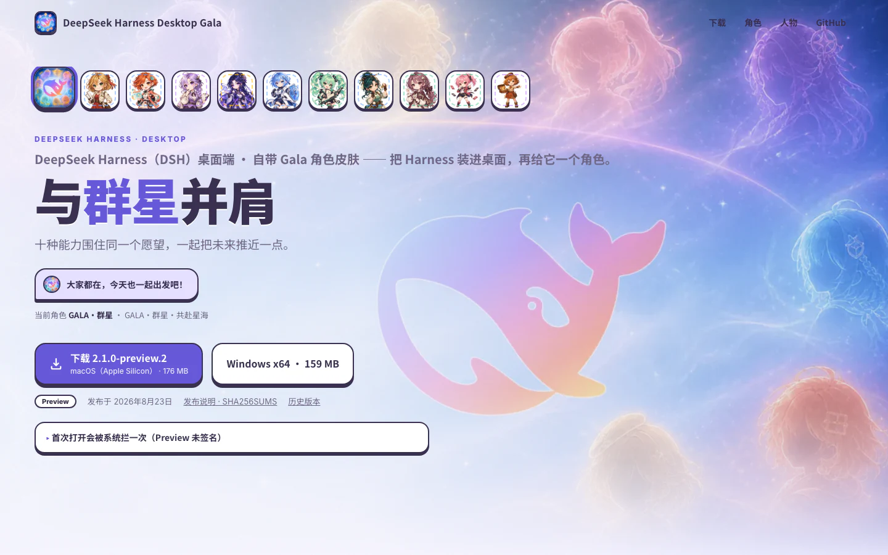
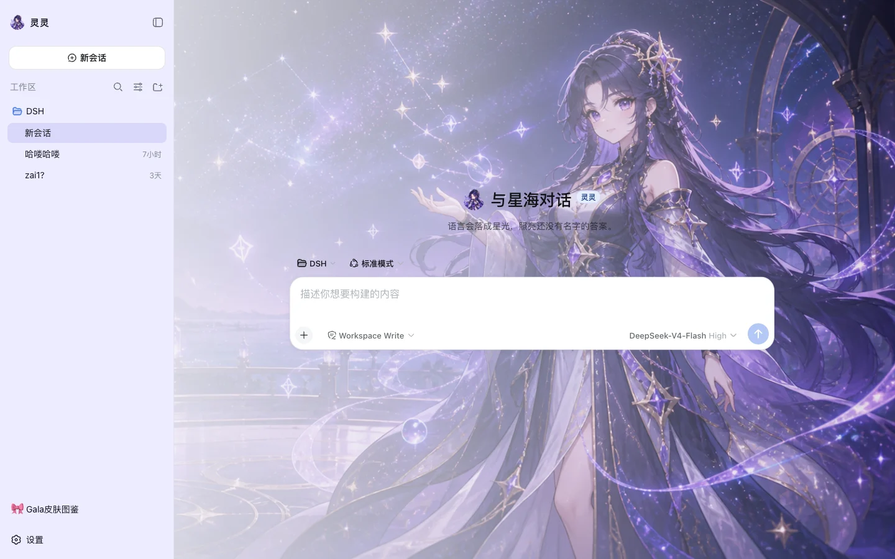

<p align="center">
  
</p>

<h1 align="center">DeepSeek Harness Desktop Gala</h1>

<p align="center">
  <a href="https://github.com/SkyNotSilent/deepseek-harness-desktop-gala/releases"></a>
  
  <a href="LICENSE"></a>
</p>

<p align="center"><sub><a href="README.md">中文</a> · English</sub></p>

<p align="center">
  <b>DeepSeek Harness on your desktop — with a character.</b><br>
  A ready-to-run desktop app for DeepSeek Harness (DSH), featuring the <b>Gala character-skin system</b>: the full ensemble appears by default, ten individual characters are one click away, and stage backdrops remain throughout every conversation.
</p>

<h3 align="center">
  <a href="https://skynotsilent.github.io/deepseek-harness-desktop-gala/">📥 Download</a>
  &nbsp;·&nbsp;
  <a href="https://github.com/SkyNotSilent/deepseek-harness-desktop-gala/releases">GitHub Releases</a>
</h3>

<p align="center">
  
</p>

## What it is

DeepSeek Harness is a plugin-first agent runtime that ships with a CLI and a Web UI. **DeepSeek Harness Desktop Gala** wraps that same runtime into a macOS / Windows application — double-click to launch, tray-resident, bundled terminal, update checks — and adds the one thing the stock UI does not have: **a character**.

The ensemble skin is active on first launch. Pick an individual Gala character and the sidebar avatar, welcome headline, full conversation backdrop and colour palette change together; “Restore ensemble default” brings everyone and the whale back. Classic character-free palettes remain available separately.

> Community project, **not an official DeepSeek product**. Free and open source — if anyone tries to sell you this software, decline.

## Features

- 🎀 **Gala character skins** — one default ensemble plus ten individual characters, each with its own palette, avatar, stage artwork and lines; import `.ggal` packs, favourite and fuse characters.
- 🖼️ **Multimodal chat** — tracks DeepSeek Harness 0.1.1 with image input and DeepSeek-V4 Flash Vision.
- 🖥️ **Zero-setup local Host** — Electron, Node and a pinned DSH runtime are bundled; no Node.js or pnpm install required.
- 🧩 **Plugin-compatible** — keeps the official `dsh plugin` semantics; compatibility mode preserves the upstream Web client, advanced mode adds a desktop-owned layout.
- 🧰 **Tray, terminal, profiles** — open a pre-configured terminal from the tray, switch profiles, close-to-tray.
- 🔄 **Safe updates** — checks GitHub Releases in the background; Preview builds only notify, signed builds ask before downloading and again before installing.

## Install

Get the installer for your platform from the [download page](https://skynotsilent.github.io/deepseek-harness-desktop-gala/):

- **macOS (Apple Silicon)**: `DeepSeek-Harness-Desktop-Gala-<version>-arm64.dmg`
- **Windows x64**: `DeepSeek-Harness-Desktop-Gala-<version>-x64-Setup.exe`

Preview builds are **unsigned**. On macOS open **System Settings → Privacy & Security** and click "Open Anyway"; on Windows choose "More info → Run anyway" in the SmartScreen dialog. Every release ships a `SHA256SUMS.txt`.

Before the first message, enter your DeepSeek API key under **Settings → Models**. It is stored locally in `~/.dsh/.credentials.yaml`.

## Run from source

Node.js 22.19+ and Corepack (Yarn 4):

```sh
git clone https://github.com/SkyNotSilent/deepseek-harness-desktop-gala.git
cd deepseek-harness-desktop-gala
corepack yarn install --immutable
corepack yarn dev
```

`corepack yarn check` runs the build, type checks, tests and the packaged-runtime closure gate. See [docs/](docs/README.md) for architecture, plugin services and the release process (Chinese).

## Acknowledgements

[DeepSeek Harness](https://github.com/deepseek-ai/deepseek-harness) provides every core capability; [Cordis](https://github.com/cordiverse/cordis) is the plugin framework that lets the desktop itself be a plugin.

## License

[MIT](LICENSE).
