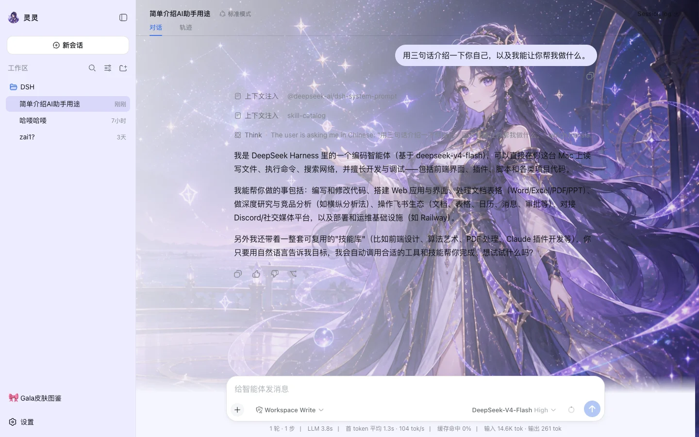

<p align="center">
  
</p>

<h1 align="center">DeepSeek Harness Desktop Gala</h1>

<p align="center">
  <a href="https://github.com/SkyNotSilent/deepseek-harness-desktop-gala/releases"></a>
  
  <a href="LICENSE"></a>
</p>

<p align="center"><sub>中文 · <a href="README.en.md">English</a></sub></p>

<p align="center">
  <b>把 DeepSeek Harness 装进桌面，再给它一个角色。</b><br>
  一个开箱即用的 DeepSeek Harness（DSH）桌面端，内置 <b>Gala 角色皮肤系统</b>：全员集合默认登场，十位角色可独立换装，整片舞台背景始终相随。
</p>

<h3 align="center">
  <a href="https://skynotsilent.github.io/deepseek-harness-desktop-gala/">📥 下载页面</a>
  &nbsp;·&nbsp;
  <a href="https://github.com/SkyNotSilent/deepseek-harness-desktop-gala/releases">GitHub Releases</a>
</h3>

<p align="center">
  
</p>

## 这是什么

DeepSeek Harness 是一个"万物皆插件"的 Agent 运行时，官方提供命令行与 Web 界面。**DeepSeek Harness Desktop Gala** 把同一个运行时封装成 macOS / Windows 应用：双击启动、系统托盘常驻、内置终端、自动检查更新——并在此之上做了一件官方没做的事：**让界面有角色**。

首次启动由十位 Gala 角色与鲸鱼共同登场；选中单独角色后，侧边栏头像、欢迎页标题、整片对话舞台背景和界面配色会一起换装。「恢复全员默认」可随时回到集合皮肤，三套经典配色则保持纯净、无人物的界面。角色是贯穿使用过程的陪伴，不只是换个主题色。

> 本项目是社区作品，**不是 DeepSeek 官方产品**。完全开源免费；如有人向你出售此软件，请拒绝。

## 功能

| | |
|---|---|
| 🎀 **Gala 角色皮肤** | 默认由十位角色与鲸鱼共同登场；也可切换阿基、小窗、阿念、灵灵、盾盾、敲敲、巧巧、忆忆、令令或宝宝。每套都有专属配色、头像、舞台立绘与寄语；支持导入 `.ggal` 角色包、收藏与合成。 |
| 🖼️ **多模态对话** | 跟随 DeepSeek Harness 0.1.1，支持图片输入与 DeepSeek-V4 Flash Vision。 |
| 🖥️ **零配置本地 Host** | 安装包自带 Electron、Node 与固定版本的 DSH 运行时；首次启动自动准备默认 profile，无需安装 Node.js 或 pnpm。 |
| 🧩 **插件生态兼容** | 继续使用官方 `dsh plugin` 语义管理插件；兼容模式保留上游 Web 客户端，高级模式提供桌面自有布局与窗口材质。 |
| 🧰 **托盘、终端、profile** | 托盘一键打开带好环境变量的终端；多 profile 切换；关闭窗口不退出。 |
| 🔄 **安全的更新策略** | 后台检查 GitHub Releases；Preview 只提示不下载，签名正式版下载与安装前各确认一次。 |

## 安装

从 [下载页面](https://skynotsilent.github.io/deepseek-harness-desktop-gala/) 获取对应系统的安装包：

- **macOS（Apple Silicon）**：`DeepSeek-Harness-Desktop-Gala-<版本>-arm64.dmg`，拖入"应用程序"。
- **Windows x64**：`DeepSeek-Harness-Desktop-Gala-<版本>-x64-Setup.exe`，按向导安装。

### 首次启动的系统提示

当前 Preview 版本**未签名**，系统会拦一次：

- macOS：打开 **系统设置 → 隐私与安全性**，在底部点击「仍要打开」（macOS 14 及更早也可右键应用 → 打开）。
- Windows：SmartScreen 弹窗中点击「更多信息 → 仍要运行」。

签名正式版发布后这些提示会消失。每个 Release 都附带 `SHA256SUMS.txt` 供校验。

### 配置 API Key

第一次发送消息前，在 **设置 → 模型** 填入 DeepSeek API Key。密钥保存在本机 `~/.dsh/.credentials.yaml`，不会进入仓库或安装包。账户余额不足时，界面会直接提示并给出充值入口。

## 使用 Gala

- 侧边栏底部 **🎀 Gala皮肤图鉴** 打开换装面板，点选角色后整站换装；「恢复全员默认」回到十位角色与鲸鱼共同登场的集合皮肤。三套经典配色仍可单独选择。
- 托盘菜单提供 **嘎啦图鉴 / 换肤面板 / 合成工坊 / 导入嘎啦包**；快捷键 `Cmd/Ctrl + Shift + S` 直达换肤面板。
- 角色数据与皮肤协议见 [`dsh-plugin-gala/`](dsh-plugin-gala/)。

<p align="center"></p>

更多说明见 [用户指南](docs/user-guide.md)。

## 从源码运行

需要 Node.js 22.19+ 与 Corepack（Yarn 4）。

```sh
git clone https://github.com/SkyNotSilent/deepseek-harness-desktop-gala.git
cd deepseek-harness-desktop-gala
corepack yarn install --immutable
corepack yarn dev
```

`corepack yarn check` 运行构建、类型检查、全部测试与打包闭包校验；`corepack yarn package:dir` 生成本机未签名应用。架构、插件接口与发布流程见 [docs/](docs/README.md)。

## 仓库结构

```
dsh-plugin-desktop/   Electron 壳：窗口、托盘、profile、终端、更新、打包
dsh-plugin-gala/      Gala 角色系统：角色库、皮肤、图鉴面板、.ggal 包、品牌座位
site/                 下载站（GitHub Pages）
docs/                 用户指南、架构、插件开发、发布流程
.github/workflows/    CI、Preview 发布、签名发布、站点部署
```

## 致谢

- [DeepSeek Harness](https://github.com/deepseek-ai/deepseek-harness) 提供了 Agent、模型、工具、会话与 Web UI 的全部核心能力。
- [Cordis](https://github.com/cordiverse/cordis) 提供了让"桌面本身也是插件"成立的插件框架。

## 许可

[MIT License](LICENSE)。
