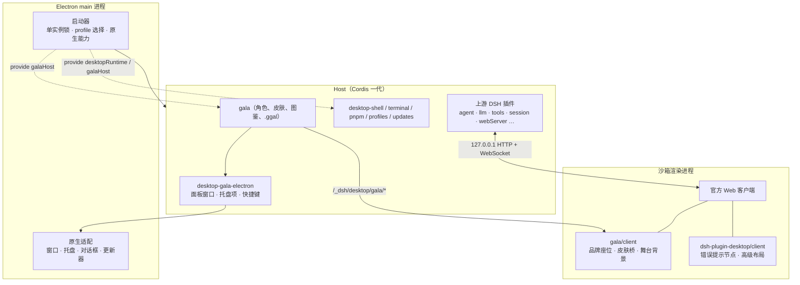

# 架构说明

## 一句话

Electron 只做壳：在 main 进程里启动 DeepSeek Harness 的 Host，Host 通过本机回环地址提供 Web 界面，窗口加载这个同源页面。桌面能力和 Gala 角色系统都以 Cordis 插件的身份挂进同一棵 Host 树，界面侧的改动只走官方扩展点。

## 启动顺序

1. Electron 取得单实例锁，读取桌面私有的 profile / 模式状态。
2. 启动器准备当前 profile（`~/.dsh/profiles/<name>`），把上游运行时的包链接进去。
3. 启动器向 Host 上下文 `provide` 三个对象：`desktopRuntime`（原生适配）、`desktopPnpmBootstrap`（内置 pnpm 的路径与 ABI 事实）、`galaHost`（Gala 需要的目录、包列表、原生能力）。
4. Cordis 根据 profile 的 bundle 与补丁装配插件树；`dsh-plugin-gala` 作为一行插入在 `desktop-shell` 之前。
5. Host 绑定回环端口，Electron 创建窗口并加载页面；页面成功后才创建托盘并把这个 profile 标为"上次可用"。
6. 窗口挂好后调用 `ctx.gala.activate()`：恢复上次皮肤、注册托盘项与快捷键。

切换 profile 或模式会整代销毁再重建，任何 service 引用、窗口对象、子进程句柄都不跨代缓存。

## 三个 workspace 角色

| 包 | 职责 | 对外暴露 |
| --- | --- | --- |
| `dsh-plugin-desktop` | Electron 启动、窗口与托盘、profile、内置 pnpm 与终端、更新、打包与发布脚本 | `desktopProfiles`、`desktopPnpm` 两个公开 service；`/client` 注册会话错误节点与高级布局 |
| `dsh-plugin-gala` | 角色库、皮肤协议与注入、图鉴/合成/市场面板、`.ggal` 包、loopback 路由 | `ctx.gala` service；`/client` 占用 `sidebar.brand.mark/name`、`conversation.hero.brand.mark`、`sidebar.footer.action` |
| 上游 `@deepseek-ai/dsh-*` | Agent、模型、工具、会话、设置、Web 客户端 | 固定版本 npm 包，不修改 |

## Gala 如何接入界面

- **配色**：皮肤定义 `--gala-color-*` 六个亮色值，`gala-skin-map.ts` 映射到官方 `--dsw-*` 设计 token 并派生深色值；客户端通过 `theme.overrideTokens` 应用，不改 CSS 文件。
- **品牌位**：`gala-brand.tsx` 以 `priority: -1` 占用官方三个品牌座位；没有角色时回退到官方 `FishLogo` / `BrandWordmark`，组件崩溃时自动退位。
- **舞台背景**：`gala-persona-presenter.ts` 在会话区域插入背景层并替换欢迎标题，跨对话常驻。这一处仍依赖上游 DOM 结构，是升级上游时需要回归的地方。
- **数据通道**：客户端通过 `/_dsh/desktop/gala/picker` 读取当前角色，通过 `/events`（SSE）收到 `skin-changed` 后刷新。

## 更新机制

`desktop-updates` 插件每 6 小时查询一次 GitHub Releases API。行为由打包时写入 `package.json` 的 `desktopUpdateMode` 决定：

- `manual-release`（Preview）：只通知并打开 Release 页面，永不调用下载或安装。
- `signed-auto`（签名正式版）：经 electron-updater 下载（用户确认后）并安装（再次确认后）；`autoDownload` 与 `autoInstallOnAppQuit` 均关闭。

未打包、预发布版本号或非 macOS/Windows 平台一律落到 `manual-release`。

## 打包

electron-builder 生成 `app.asar`，但需要物理存在的依赖（上游运行时、pnpm、node-pty、Windows ACL 原生模块、Gala 资产）全部 `asarUnpack`。`afterPack` 钩子 `verify-packaged-runtime.ts` 校验必需入口与 Windows 的 ConPTY 预编译文件，缺一即失败。`dsh-plugin-gala` 作为 workspace 依赖随 `node_modules` 进入安装包，源码与测试配置被排除。
